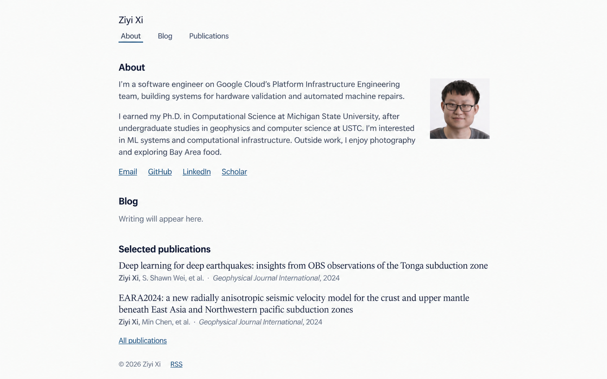

# 个人学术网站技术规划

更新日期：2026-09-21（America/Los_Angeles）。**用户已认可 v6 概念图方向，并在本轮明确授权按本文实现个人网站。** 本文仍是架构与上线边界的主要交接文档；下文“当前交付”记录实际完成度，账号、域名与线上行为不得因本地代码存在而视为已验证。

## 1. 已确定的方向与范围

采用 **Next.js App Router + React + TypeScript + CSS Modules + Notion 官方 API + GitHub Actions + Vercel**。网站以个人介绍、写作和论文为核心，风格简洁、紧凑、有学术气息，避免论坛、后台或营销页面的外观。

| 决策 | 实施约定 |
| --- | --- |
| 视觉基准 | 以 [v6 概念图](assets/homepage-concept-v6.png)为准；v1–v5 和旧调研中的冲突建议仅作历史资料 |
| 内容顺序 | 小号姓名、左对齐导航、About 与照片、Blog、Selected publications、页脚 |
| 分区方式 | 标题、对齐和适度间距；不用横贯页面的分隔线，不再设左侧章节标签栏 |
| 博客初始状态 | 明确的空内容模式，显示 “Writing will appear here.”；不导入旧 CUDA 文章，不虚构文章 |
| 后续写作 | 用户自行迁移至专用 Notion 数据源；接入后通过同一校验/发布流程更新 |
| 个人资料与论文 | 仓库中的结构化文件；无需全部搬进 Notion，也不运行时抓取 LinkedIn/Scholar |
| 发布 | GitHub Actions 检查、构建、测试候选部署，通过后才切换生产域名 |
| 当前授权 | 已授权本地实现、安装锁定依赖以及建立 CI/发布骨架；未授权连接账号、修改旧站、域名或执行部署 |

首期交付包括首页、博客列表、文章详情、论文列表、404、RSS、SEO、响应式与发布回退。CV 仅在用户提供真实文件后启用。暂不做评论、登录、点赞、论坛、搜索服务、CMS 后台、自动翻译、深色主题、统计 SDK 或花哨动画。无需独立数据库、Redis、队列或常驻后端。

实施可以先完成“个人主页 + 空 Blog”，再启用 Notion；这两个阶段都必须有真实、可解释的内容来源状态。

## 2. 视觉方向：有分区、有棱角的紧凑学术主页

[生成提示词与来源](assets/homepage-concept-v6.prompt.txt)。用户已表示这版方向可以；这不等于逐像素稿、正式履历或移动端已验收。后续按真实字体和内容调整，不重新发散设计。

### 2.1 版式规范

| 项目 | 起始规范 |
| --- | --- |
| 主栏 | 居中约 780–820px，以 800px 起步；文章正文约 660–680px |
| 姓名、导航 | 姓名 18px 常规无衬线，不比章节标题醒目；下一行靠左排列 About、Blog、Publications；当前项只用短下划线，不用填色大 tab |
| 简介 | 两段，16px / 约 1.5 行高；照片位于右侧，与 About 文字区域垂直居中对齐，图文间距约 28px |
| 照片 | 桌面照片列宽为 `clamp(136px, 20%, 160px)`，固定 4:5 宽高比，不随简介高度伸展。直角、无边框阴影，用 `object-fit: cover` 居中裁切原图、不拉伸。窄屏照片在正文前，固定 128×160px，靠左显示 |
| 分区 | 章节标题在内容上方、同一左边界；区间约 28–34px，标题至内容约 10–12px，段间约 12–16px |
| 论文 | 题名 16–18px 朴素衬线，小字作者/期刊或会议/年份 13–14px 无衬线；两篇精选等权重，长题名自然换行 |
| 博客 | 有内容后，日期加无衬线题名，每项约 28–32px 起步；首页最多最近 3 篇，不加封面或摘要 |
| 字体 | 优先 Source Sans 3 + Source Serif 4，中文使用完整系统回退；字体文件随项目托管并保留许可，使用 next/font/local |
| 颜色 | 背景 #FAFBFA，正文 #212B31，链接 #294D66，辅助字 #59656C |
| 页脚 | 随正文结束，小号版权与 RSS；不固定到底部，不刻意拉开大空白 |
| 窄屏 | 小于约 640px 时照片置于简介正文前，固定 128×160px、独占一行并靠左；保持自然阅读顺序。导航可换行，左右留白 20–24px |

实现中保留明确焦点与链接状态、正常标题语义；只有当前导航文字下的短线，无章节横线、侧栏、卡片、装饰封面或图标墙。头像不能用概念图中重新生成的人脸裁切替代。

在 1366×768、1280×800 内容区首先验证空 Blog 状态的首屏密度；有 3 篇长标题文章时尽量保留各区入口可见，不承诺全部正文永久塞进一屏。不能为了首屏裁切标题、缩小作者信息或设置固定页面高度。375px 窄屏、200% 字体放大和长文正常滚动。

### 2.2 已有资料与来源

- 姓名：Ziyi Xi。2026-09-21 按用户要求，以 [LinkedIn About](https://www.linkedin.com/in/ziyixi/) 更新为两段简洁英文简介：当前在 Google Search Quality 从事查询理解、低延迟语言模型与模型效率；此前负责 Google 基础设施可靠性和自动恢复，TPU 系统仅作为工作涉及的实例。保留 MSU Computational Science Ph.D.、AI for science/计算地震学/HPC 研究，以及 USTC 地震学和计算机双学位背景。正式文案以 `content/profile.json` 为准，不恢复旧版 Cloud 任职或未出现在这次 About 中的兴趣介绍。
- 照片：2026-09-21 按用户最终选择，使用灰色背景的人像 `public/profile/ziyixi-headshot-2026.png`，保留原图 1122×1402；按用户最新反馈收敛照片大小，桌面列宽为 `clamp(136px, 20%, 160px)`，固定 4:5 宽高比，与 About 文字区域垂直居中、间距 28px，不再随文字高度伸展。窄屏照片固定 128×160px，位于简介正文前并靠左。旧 `assets/ziyixi-portrait-reference.png` 和户外照片仅作历史参考，不再用于正式头像。
- 外链：GitHub、LinkedIn 已有来源；Email、Scholar 的实际地址需从已确认资料核对，未确认就隐藏，不使用占位链接。
- 论文种子：下表来自此前核实的出版记录，完整作者顺序仍须录入并校验；不将搜索摘要直接作为正式书目。

| 论文 | 首页短作者形式 | 发表信息 |
| --- | --- | --- |
| [Deep learning for deep earthquakes: insights from OBS observations of the Tonga subduction zone](https://doi.org/10.1093/gji/ggae200) | Ziyi Xi, S. Shawn Wei, et al. | Geophysical Journal International, 238(2), 1073–1088, 2024 |
| [EARA2024: a new radially anisotropic seismic velocity model for the crust and upper mantle beneath East Asia and Northwestern pacific subduction zones](https://doi.org/10.1093/gji/ggae302) | Ziyi Xi, Min Chen, et al. | Geophysical Journal International, 239(2), 914–935, 2024 |

[12 个 CS 主页调研](cs-homepage-survey.md)仅作为历史参考。其 v5 横线、侧标签栏等决定已被 v6 覆盖，不能据此恢复旧版外观。旧 CUDA 博客不作为新站种子内容、fixture 或默认迁移对象；旧 URL 的处置另见第 10 节。

## 3. 架构、渲染与内容模式

### 3.1 数据流与职责边界

~~~mermaid
flowchart LR
  A[仓库个人资料与论文] --> V[规范化与校验]
  E[明确的空博客模式] --> V
  N[Notion 已发布文章] --> S[同步与媒体固化]
  S --> V
  V --> C[不可变内容快照]
  C --> B[Next.js 预渲染构建]
  B --> D[Vercel 候选部署]
  D --> T[线上冒烟检查]
  T --> P[提升同一部署到生产]
~~~

渲染层只读取一次同步完成后的本地快照。Notion SDK、token 和网络抓取只在同步工具中使用，不能被页面组件或客户端导入。Next 构建不重新抓 Notion；访客请求不依赖 Notion 可用性。

采用 Vercel 的标准 Next.js 部署输出，不启用 `output: export`。主要页面预渲染；保留框架的图片、路由、重定向与元数据能力，不为追求“静态”另搭服务。

### 3.2 三种明确模式

| 模式 | 用途与输出 | 错误行为 |
| --- | --- | --- |
| `empty` | 初始正式站：真实个人资料/论文 + 合法空文章集合；完全不访问 Notion | 缺少 Notion secret 是正常的；其他资料/构建错误仍失败 |
| `notion` | 正式内容同步：必须配置 token、data source、API 版本 | 缺凭据、权限错误、截断查询、未知块或必要媒体失败，一律中止，不回退 empty/fixture |
| `fixture` | 本地开发与 PR 测试：明确合成且固定的文章样本 | 正式发布入口拒绝此模式；不得作为线上 fallback |

版本控制中的 `site.config.ts` 持有正式 `blogSource: empty | notion`；fixture 只能由开发/CI 命令显式选择。不能通过“有没有 token”猜模式。以后切换到 notion 是一个小的配置变更和首次同步验收，不需要重做页面。

成功查询得到零篇已发布文章是正常数据，与请求失败分开。若此前非空、这次变成全空，默认中止并列出撤下数量；维护者核实为有意清空后，通过受信任手动运行的一次性 `allowEmpty` 放行。该开关不能豁免权限、分页或 schema 错误。

### 3.3 Next.js 具体约定

- App Router、Server Components 优先。首期的导航、论文与正文无需整页客户端状态；toggle/目录优先原生 details/summary。
- 博客页通过 `generateStaticParams` 从快照枚举全部公开 slug，并设置 `dynamicParams = false`；不存在或撤回的地址返回真实 404。页面与 generateMetadata 使用同一读取器。
- **首期不启用 Cache Components/PPR/ISR**。目前官方文档指出启用 Cache Components 时，generateStaticParams 的空数组会导致构建错误；初始空 Blog 不应为此制造假 slug。[静态路由与空数组约束](https://nextjs.org/docs/app/api-reference/functions/generate-static-params)
- sitemap 使用框架元数据约定；RSS 的 GET 明确配置为构建期静态输出，不假设 Route Handler 天然缓存。每次都从当前快照产生，零文章时返回合法空 feed。[Route Handlers](https://nextjs.org/docs/app/getting-started/route-handlers)
- 以构建报告和断网读取测试确认上述页面不在访问时回源。客户端不请求 Notion，也不嵌入原始 SDK JSON。
- `/build-info.json` 是随部署生成的静态文件，但访问响应明确 no-store；内容不因请求时间变化。它是发布身份核对信息，不是运行时同步接口。

## 4. 包、目录与命令契约

### 4.1 依赖选择

以 Next.js 16 稳定线作为实施起点；React 跟随所选 Next 的 peer dependencies。Node 统一用 24.x，Vercel 当前支持该版本；平台会更新 minor/patch，因此承诺相同 major 和可追溯构建环境，不承诺平台二进制永不变。[Vercel Node 版本](https://vercel.com/docs/functions/runtimes/node-js/node-js-versions)

| 包/能力 | 用途 |
| --- | --- |
| `next`、`react`、`react-dom` | 页面、路由、预渲染与部署 |
| `typescript`、`@types/node`、`@types/react`、`@types/react-dom` | strict 类型检查；类型包为开发依赖 |
| CSS Modules、CSS variables、`next/font/local` | 本站排版；不引入 Tailwind、shadcn/ui、MUI 或 Ant Design |
| `@notionhq/client`、`zod` | 官方只读同步和边界校验；SDK 只被同步工具导入 |
| `shiki`、`katex` | 构建时高亮与公式渲染；不把高亮器整体放进客户端 |
| `sharp` | 同步阶段验证图片并读取尺寸；头像与正文优先使用本地资源，避免永久依赖签名 URL |
| `tsx` | 运行 TypeScript 内容工具，开发依赖 |
| `eslint`、`eslint-config-next`、`prettier`、`eslint-config-prettier` | 静态检查与格式，开发依赖 |
| `vitest`、`@playwright/test`、`@axe-core/playwright` | 内容边界测试、真实页面验证、自动无障碍检查，开发依赖 |
| `vercel` | CI 使用固定 CLI 版本，开发依赖 |

RSS 先输出标题、摘要、永久链接和日期，用小型 XML 生成器并测试转义；无需全文 HTML feed、MDX 包或搜索索引依赖。业务包与开发工具分别放在对应 dependency 类别，不把“构建时运行”等同于“浏览器端运行”。

实施时核对当前稳定 patch、安全公告与互相兼容性，提交 pnpm-lock.yaml，并在 packageManager 固定 pnpm 版本。CI 使用 frozen lockfile。ESLint 独立执行；Next.js 16 起 next build 不再代跑 lint。[安装与 lint 文档](https://nextjs.org/docs/app/getting-started/installation)

### 4.2 未来目录

下列为职责设计，现在不创建这些文件：

~~~text
src/
  app/                    路由、页面、元数据、RSS、404
  components/             SiteHeader、ProfileIntro、BlogList、PublicationList、ArticleBody
  lib/content/            schema、只读快照访问、排序、URL 与日期工具
  styles/                 字体、颜色、间距与正文样式
content/
  profile.json            个人资料与已核实链接
  publications.json       完整书目与首页精选顺序
  redirects.json          经确认的旧地址映射
  site.config.ts          canonical origin、正式内容模式等公开设置
scripts/
  content/                empty/fixture/notion 适配器、媒体、校验、快照打包
  release/                候选测试、发布记录、promote/rollback 包装
tests/
  fixtures/               合成 Notion 响应和正文边界样本
  unit/                   转换、校验、日期、链接、hash
  e2e/                    页面与部署验收
public/
  profile/                原始头像及可选真实 CV
  fonts/                  字体与许可
  media/                  每次生成的公开文章媒体
.generated/               构建输入、私有诊断、manifest；不公开整个目录
.github/workflows/        PR 检查与受信任发布
~~~

`.generated/`、生成的 public/media/、`.vercel/`、测试报告及含密钥 env 文件不提交。头像、字体和用户手工维护的资料提交仓库。同步清理只针对其拥有的生成目录，不能清掉 public/profile 等手工资源。

### 4.3 命令接口

| 未来命令 | 输入、输出与边界 |
| --- | --- |
| `pnpm content:prepare --source=empty\|fixture\|notion --baseline=...` | 唯一内容准备入口；接收显式本地登记表，输出快照、公开媒体、内部 manifest；退出 0 表示完整成功 |
| `pnpm content:validate` | 离线校验已准备产物及所有站内引用；不补抓数据 |
| `pnpm format:check / lint / typecheck / test:unit` | 无密钥检查；typecheck 使用框架需要的类型生成与 tsc，不把 build 当全部检查 |
| `pnpm dev` | 消费显式准备的 empty/fixture 快照，缺快照时提示准备命令；不偷偷联网 |
| `pnpm build` | 校验并运行 Next 生产构建，缺快照失败；不做 content:prepare |
| `pnpm test:e2e` | 对本地产物跑 fixture/empty 页面测试 |
| `pnpm test:deployment --base-url=...` | 对明确候选 URL 做 HTTP/浏览器测试，检查 build-info 与 manifest 匹配 |
| `pnpm release:promote / release:rollback` | 仅受信任发布上下文调用；核对身份、项目、状态和目标 ID，不根据“最近一个 URL”猜部署 |

命令的精确实现留到实施，但不得把抓取隐含在 prebuild/postinstall 中，否则同一发布可能混用两份内容。

### 4.4 starter kit 的借鉴边界

用户指定 [nextjs-notion-starter-kit](https://github.com/transitive-bullshit/nextjs-notion-starter-kit) 仅作参考。此前已只读查看其 App Router、站点配置、slug 映射与内容封装，不要求 fork 或复制外观。

可借鉴 `site.config.ts`、`lib/notion.ts`、`lib/get-site-map.ts` 的职责分层；其 `notion-client` / `react-notion-x` 使用 ExtendedRecordMap，**官方 SDK blocks 不能直接传入该 renderer**。默认自建有限块适配层；公开页面抓取或 notion-to-md 仅是将来重新评估的替代方案，不同时维护两套生产内容源。不要复制模板的侧栏、封面或关闭候选部署鉴权的配置。[参考数据层](https://github.com/transitive-bullshit/nextjs-notion-starter-kit/blob/main/lib/notion-api.ts)

## 5. 内容模型与页面契约

### 5.1 仓库资料

| 模型 | 最少字段与规则 |
| --- | --- |
| SiteConfig | canonicalOrigin、title、description、defaultLanguage、blogSource、homePostLimit=3、精选论文 ID；URL 必须是明确 HTTPS origin；构建的 SITE_URL 从这里派生，若环境重复提供则必须一致 |
| Profile | name、bioParagraphs、portrait(path/alt/width/height)、links、可选 cvPath；禁止任意 HTML，缺实际值的链接不渲染 |
| Publication | id、title、authors[]、venue、year、可选 volume/issue/pages/doi、links、homeAuthors、featuredOrder；authors 包含完整顺序与可选本人标识；没有 DOI 时必须提供实际资源链接，不伪造 DOI |
| Redirect | from 唯一、不能覆盖真实路由；页级映射用 to 指向存在的公开路由；文章级旧址用 targetPostKey 关联稳定文章身份，随文章撤稿停用；拒绝环、链式跳转、未知文章身份及任意外部目标 |

书目记录的 id 稳定、不用数组下标；按年份倒序、同年按明确顺序再按 id 排序。首页使用经认可的 homeAuthors 短引用，完整论文页展示全体作者。题名不擅自缩写；资源只展示真实 DOI/PDF/Code/BibTeX，不自动抓 Scholar 或伪造下载文件。

### 5.2 博客规范化模型

每篇内部记录包括：稳定 sourceId/sourceKey、slug、title、summary、language、publishedAt、可选 updatedAt/tags、正文 blocks、toc、media 引用。原始 Notion ID 只留在同步内部；sourceKey 为固定命名空间与规范化页面 ID 的 SHA-256 摘要。页面 link 使用当前本站 URL；RSS GUID 使用不随域名/slug 改变的 `urn:ziyixi:post:<sourceKey>`，标明不是永久链接。

中英文译文增加可选 `translationKey`：每种语言仍使用独立 Notion 页面、slug、sourceKey 与 RSS GUID；相同非空 key 表示同一文章。只在当前公开集合内配对，不根据标题或 slug 猜测。未填写 key 或尚无公开译文时正常单篇显示；同组同语言出现多个公开页面则报告明确的关联冲突。旧快照没有此字段时仍兼容，key 参与快照 hash 与同步一致性指纹。

修改标题不会改变 slug。若作者明确改动已发布的 Slug 字段，同步器与持久登记表比较，生成该文章旧址到新址的直接 308，不要求再手动维护多跳链；保留全部历史 slug，不能让其他文章占用。文章撤稿后，其自动别名和按 targetPostKey 关联的旧站入口一起停用并返回 404，不能因为旧别名目标消失而阻止撤稿。普通手写页级重定向仍严格校验目标。

- slug 首期限定小写 ASCII 字母/数字/短横线，例如 `research-notes`；校验归一化后的唯一性，拒绝斜杠、路径穿越、保留路由名和编码歧义。
- 日期采用确定规则：只含日期时按 UTC 当日 00:00 处理，含时间时必须有 offset 并转 UTC；网页使用稳定格式，不随访问者时区漂移。未来发布时间不发布；相同日期按 slug 稳定排序。
- 更新日期仅在实际展示且有可信来源时启用；不要用每次同步时间冒充修改时间。
- 首页先按 translationKey 分组，再按组内最早 publishedAt 降序取最多 3 组；博客页显示全部当前文章组。补发译文不会让旧文章重新上浮。站点默认语言为优先展示版本，没有该语言时使用现有版本。双语组显示两个标题和 `English / 中文` 入口，文章头部提供同样的语言切换。首期不分页、不做 tag 路由，也不强迫单语文章配对。

### 5.3 页面、响应与状态

| 路由 | 具体行为 |
| --- | --- |
| `/` | v6 布局；About → Blog → Selected publications；空 Blog 仍显示标题和空态 |
| `/blog` | 日期、标题、摘要、可选少量标签；empty 或合法零文章时返回 200 与空态 |
| `/blog/[slug]` | 标题、日期、语言、正文、可展开目录；默认作者为本站主人；未知/撤回返回 404 |
| `/publications` | 完整作者与出版信息、真实资源链接；首页两篇并不意味着只允许两条书目 |
| `/cv.pdf` | 用户提供才存在，否则入口隐藏、地址 404 |
| `/feed.xml` | RSS 2.0，公开文章的标题/摘要/链接/日期；零篇也是合法 XML |
| `/sitemap.xml` | 仅真实公开 canonical 路由；不含草稿、旧重定向源和虚构文章 |
| `/robots.txt` | 正式域名允许公开内容；候选保护由部署层控制，不把 noindex 编进同一生产产物 |
| `/build-info.json` | codeSha、contentHash、configHash、schemaVersion；无 token、Notion ID 或原始快照 |
| 旧链接 | 仅按显式 redirects 清单返回 308；其余真正不存在的页面返回 404，不一律跳首页 |

站点外层 lang 以默认界面语言为准，文章主体设置自身 language。一个语义 H1、后续 H2/H3；视觉小姓名不妨碍语义标题。提供 skip link、aria-current、可见焦点。文章代码/宽表格在自身容器滚动，不使整页横向溢出。

SEO 使用 Metadata API：明确 title、description、canonical、Open Graph、网站/作者资料；个人资料用 Person，文章可用 BlogPosting 结构化数据，均只填有来源字段。头像不热链，明确尺寸与 alt，防止页面跳动。外部链接正常工作；PDF 链接标识文件类型。

每个语言页面保留自己的 canonical，互为译文时在 metadata 和 sitemap 提供双向 hreflang；草稿、未来版本和已撤回版本不进入关联。RSS 继续保留每种语言的独立条目，使订阅者能收到新增译文；manifest 数量、registry 和撤稿保护仍按真实页面计算，不按展示分组改写。

## 6. Notion 同步与正文处理

### 6.1 接入与字段

使用 internal integration，仅开启 **Read content**，只共享专用 Blog database/data source；不授权整个私人父页面。只读权限与“只能读已发布”是两回事，Published 过滤仍由本站负责。不需要写入、评论或用户列表权限。[Notion capabilities](https://developers.notion.com/reference/capabilities)

正式选择 `dataSources.query` 与 NOTION_DATA_SOURCE_ID。目前官方 SDK 支持 API `2026-03-11`，默认版本仍可能是 `2025-09-03`，必须显式指定、固定 SDK，并按所选版本使用 `in_trash` 等字段。实施时再次验证 API/SDK 兼容，不混用旧 databases.query 教程。[SDK](https://github.com/makenotion/notion-sdk-js#requirements-and-compatibility)、[版本变更](https://developers.notion.com/reference/changes-by-version)

| Notion 字段 | 类型 | 约束 |
| --- | --- | --- |
| Title | title | 已发布文章必填 |
| Slug | rich_text | 必填、稳定且唯一 |
| Status | status | Draft / Published；未知值不发布并报告配置问题 |
| PublishedAt | date | Published 必填；按第 5 节规则处理未来时间 |
| Summary | rich_text | Published 必填，1–2 句，用于列表/SEO/feed |
| Language | select | en / zh-CN，Published 必填 |
| Tags | multi_select | 可选，不作为发布条件 |
| TranslationKey | rich_text | 可选列；译文填写相同非空值，普通文章留空；同组每种语言最多一个公开版本 |

正文来自该 page 的 blocks。首次以及每次同步先核对 data source schema 和字段类型；项目可在配置中固定属性 ID，字段改名/类型变化必须显式适配。用户只需要在 Notion 编辑并切换 Published，网站不反写 Notion。首期不添加无用途的 Featured 字段或草稿预览站。

### 6.2 同步顺序

1. **预检**：检查配置、API 版本、数据源权限/schema；加载第 6.5 节定义的上一有效发布登记表，创建全新运行目录，确定本次 cutoff 时间。
2. **公开集合**：查询并校验 Published、发布时间已到、未删除的页面；草稿正文不抓取、不进产物。完整遍历 cursor，不能以“返回条数不足 page_size”判断结束。
3. **完整性**：逐级分页递归 blocks.children；若 API 报不完整结果或达到保护上限，整次失败。当前 SDK 说明大查询可出现 `has_more=false` 但 `request_status.type=incomplete`；不能把截断集合当成撤稿。[分页与查询完整性](https://github.com/makenotion/notion-sdk-js#iteratealldatasourcerowsclient-args)、[子块接口](https://developers.notion.com/reference/get-block-children)
4. **转换**：转为本站有限的内部 block 联合类型；生成稳定锚点、目录、page ID → slug 映射，检查所有站内链接。
5. **媒体固化**：下载本轮公开正文引用的必要媒体，记录真实尺寸与字节 hash，重写为本地相对路径；详见下节。
6. **结束复核**：重新读取公开集合/可观察版本，检查同步过程中撤稿或修改；发现变化最多重做一轮，持续变化则失败。不得仅用顶层 last_edited_time 跳过子块读取。
7. **全量校验**：schema、URL、slug、日期、渲染能力、媒体、重定向、文章间引用与移除清单；从非空到全空需要前述显式确认。
8. **完成快照**：原子写入已完成 manifest，然后交给构建。构建拒绝未完成快照；后续测试与部署共用这一份内容。

初始参数建议：Notion 请求并发不超过 2，整体限速约 2 次/秒，单次超时 30 秒，总同步超时 10 分钟；429 尊重 Retry-After，网络/5xx 使用带抖动的有限重试，总尝试不超过 4 次。SDK 与外层只能有一处负责重试，避免倍增；鉴权/schema/未知块不盲重试。[官方请求限制](https://developers.notion.com/reference/request-limits)

API 不提供全站事务快照，上述检查只能降低边编辑边发布的不一致，不能承诺严格事务或撤稿即时生效。日常编辑完成再切 Published；紧急撤稿通过手动发布并确认线上结果。

### 6.3 正文渲染契约

内部块只保留本站需要的内容、children 与公开属性，不透传原始 API JSON。支持段落、H1–H3、富文本粗斜体/链接/行内代码、嵌套列表、引用、分隔线、代码块、公式、图片/caption、表格、toggle、简单 callout；所有渲染分支必须穷尽处理。

- Notion 标题级别映射到文章 H1 以下；重复标题锚点有稳定后缀，目录链接可回到对应内容。
- 普通文本与原始 HTML 一律转义；不执行 MDX/JavaScript、任意 iframe 或嵌入脚本。代码/公式只使用 Shiki/KaTeX 生成的标记，KaTeX 关闭 trust。
- 已知代码语言按固定清单加载；未知语言保留纯文本并给维护者提示，不能丢代码。非法公式报告所在文章/块并中止发布。
- 普通外链支持 HTTP、HTTPS 与 mailto；保留作者提供的协议，不自动升级 HTTP，也不因 Notion 自动生成 HTTP 链接而要求作者修改正文。链接跳转与服务器下载是不同边界：图片下载及站点 canonical 仍要求 HTTPS；危险协议与 URL 内的凭据仍拒绝。
- bookmark 可按明确规则降级为正常 HTTP/HTTPS 链接；嵌套数据库、synced block、任意子页面遍历、复杂 embed 等首期不支持，遇到时报告文章与块类型并失败。
- Notion page mention/link 只有目标在公开集合时才重写为站内链接；指向私有/未知页面时阻止发布并要求作者处理，不自动公开内部标题或 ID。
- caption 可用于图片说明与 alt；没有可用替代文本时给出维护提示，装饰图需明确为空 alt。不得把文件名机械当作有意义的替代文本。

### 6.4 图片与附件

Notion 托管 URL 约一小时有效，不能写进长期静态 HTML。同步后立刻下载；若过期，有限次重新读取所属块取得新 URL，再校验并下载。仍失败则保留线上旧版本，不能发布破图。[文件对象](https://developers.notion.com/reference/file-object)

生成路径采用 `/media/<sha256>.<ext>`；快照只包含该路径、类型、尺寸、说明和 hash，不保留签名参数。内容相同可去重，但每次发布必须列出其完整引用集合，不复用残留旧目录。第一期不引入对象存储。

远程下载只接受 HTTPS 与配置过的来源，校验重定向目标、类型、大小和超时，拒绝内网地址。初始允许常见栅格图片；PDF 附件需显式支持并作为普通下载，不内嵌。SVG/HTML 不直接当可信图片执行。限额可配置，起点为单图 20 MiB、单附件 25 MiB、总媒体 200 MiB；超限报告实际文件，由维护者压缩或扩展方案，不静默省略。

### 6.5 快照、hash 与重复构建

跨发布必须保留内容身份状态，不能只留一个 hash。第 7.5 节的 GitHub Deployment payload 同时保存小型累计 `contentRegistry`：registryVersion、sourceKey、currentSlug、historicalSlugs、feedGuid、当前是否公开及当前文章数。它不含正文、原始 Notion ID、签名 URL 或密钥，只有公开过的路由与不可逆身份摘要。

普通同步以**实际当前生产 deployment ID 与 build-info 身份均匹配的成功记录**为基准，回退时选回该旧部署的登记表；不能直接采用时间最新但已失败的候选登记表。后者只用于发布状态阻断。发布编排先读取该状态并传入本地 baseline 文件；内容转换器不自行查询 GitHub/Vercel，也不需要它们的密钥。基准找不到、读取失败或版本不兼容就停止自动发布；只有显式 bootstrap 才允许初始化空登记表。本地/PR 使用显式的空白或合成前序登记表，不访问线上状态。

本轮生成 candidateRegistry，候选成功上线并记 success 后才成为下轮基准。历史别名保留在登记表用于撤稿后重新发布的识别，但不代表所有历史 URL 都继续对外生成。平台记录不是草稿备份；敏感撤稿如涉及历史路由信息，需额外处理历史发布记录。登记表过大或无法持久化时必须失败，不能截断状态继续上线。

`.generated/content/snapshot.json` 至少包含 schemaVersion、sourceMode、稳定排序的公开文章与媒体清单、规范化站内链接和重定向。内部 manifest 保存各路由、预期响应、媒体校验值、来源映射、同步诊断；只有用于验证的最小 build-info 对外公开。

发布身份定义为 **codeSha + contentHash + configHash**：

- contentHash 覆盖所有影响输出的规范化文章字段、正文顺序、媒体字节 hash；公开的 updatedAt 若显示也参与。
- 排除抓取时间、签名 URL、过期时间、请求 ID、未展示的内部时间戳。诊断另存，避免无内容变化却反复发布。
- configHash 覆盖 canonical origin、正式内容模式、schema/渲染契约版本与影响输出的公开配置；仓库资料也由 codeSha 覆盖。
- 构建环境/平台配置变化由手动 forceBuild 重建，不宣称 hash 能观察 Vercel 所有外部状态。
- 生产 build-info 合法且三项身份一致、发布状态正常时跳过构建部署。没有清单或清单无效时不得当作“没变化”；先检查生产可达性与迁移状态。

原始抓取数据、来源 ID 与诊断不放 public、不上传公开 artifact。可留受控的脱敏失败报告；构建、测试均从相同已校验快照读数据。

## 7. GitHub Actions 与 Vercel 发布链路

### 7.1 工作流划分

| 工作流 | 触发/权限 | 必做工作 |
| --- | --- | --- |
| PR checks | pull_request；contents:read，无 Notion/Vercel secrets | 锁定安装、格式、lint、类型、内容单测；empty 与 fixture 两种生产构建和本地 E2E |
| Production release | main push、受信任手动运行、每 2 小时 schedule；最小发布权限 | 锁内固定 main，准备真实/empty 快照、检查、生产配置构建、候选测试、promote、生产核验 |
| 手动恢复 | 同一发布工作流的受限 recovery 输入 | 排查后解除失败状态；重跑全套校验，不提供直接跳过测试按钮 |

正式内容模式取仓库配置；在 empty 模式定时事件可以立即正常跳过，不访问 Notion。进入 notion 后建议避开整点，如每两小时第 17 分钟同步。GitHub schedule 可能延迟/丢失，公开仓库长期无活动可能暂停定时；保留手动入口并在维护文档解释，不承诺两小时硬时限。[schedule](https://docs.github.com/en/actions/reference/workflows-and-actions/events-that-trigger-workflows#schedule)

所有正式触发复用同一 concurrency group，`cancel-in-progress: false`，范围从同步开始直到发布/回退结束；锁内选择并固定最新 main。promote 前再检查 main，已变化则放弃过时候选，让新运行处理。不假设触发事件严格 FIFO；GitHub pending 运行可能被后来的替换。[并发控制](https://docs.github.com/en/actions/how-tos/write-workflows/choose-when-workflows-run/control-workflow-concurrency)

PR 不使用 pull_request_target 执行带密钥的外部代码。手动正式任务拒绝任意非 main ref；recovery 是维护操作，不允许未受信任 PR 触发。依赖缓存只存包缓存，不能缓存 .vercel 或 env；第三方 Actions 固定可审查的 commit SHA。

### 7.2 唯一自动发布入口

项目设 `git.deploymentEnabled: false` 关闭所有分支的 Vercel 自动 Git 部署。不能只关 main 而默认允许其他分支，也不能只建 GitHub 检查却让 Vercel 同时上线。该配置不限制有权限者在控制台手动 promote；维护者需遵守发布流程。[Git 配置](https://vercel.com/docs/project-configuration/git-configuration#gitdeploymentenabled)

main 必需检查与直接 push 限制按实际 GitHub 仓库能力配置。普通定时发布不默认增加每次人工审批；首次域名接管和故障恢复是单独受控步骤。

### 7.3 一次正式发布的执行顺序

1. 取得发布锁，读取持久发布状态；非正常状态停止自动发布，bootstrap/recovery 仅按下述受信任手动例外处理。固定 main SHA，核对 Vercel 项目/组织，安装锁定依赖并执行静态检查、单测。
2. 按显式 empty/notion 模式准备一次完整快照，校验。比较已上线身份；正常运行没变化则退出。bootstrap、recovery 和 forceBuild 绕过此提前退出，执行完整构建与验证；此时仍不改线上域名。
3. `vercel pull --yes --environment=production` 拉取项目配置；`.vercel/` 不提交、不上传为 artifact，NOTION_TOKEN 不进入 Vercel 项目环境。
4. `vercel build --prod` 读取同一快照，显式传入 SITE_URL 等公开构建配置；不在构建中再次同步，不依赖 prebuilt 中可能缺失的自动系统变量。
5. `vercel deploy --prebuilt --prod --skip-domain` 上传既有产物，获得唯一候选 deployment ID/URL；等待部署可用，记录当前生产 ID。
6. 对候选进行第 9 节检查，先核对 build-info 身份，再核验每条公开路由、图片、RSS、canonical、404 与代表性文章渲染。empty 模式检查空态；notion 有文章时检查真实正文，不能用 fixture 冒充。
7. 再确认 main 未前进、候选仍对应本次身份、当前生产仍是预期旧 ID；创建/更新持久发布记录，然后 `vercel promote <candidate>`。
8. 在正式 canonical 域名上**不带绕过凭据**检查公开访问与 build-info；成功才记为 release success。失败则尝试恢复此前生产，验证恢复结果，标记失败并停止后续自动 promote。

首次接管域名用明确的手动 `bootstrap`：只允许尚无本站发布记录的目标项目，核实旧站恢复方案；完成步骤 1–6 后，按第 10 节执行域名绑定/迁移与 promote，再做步骤 8，写首条 success。旧站仍占用 canonical 域名时，不能提前要求其 build-info 匹配新站；旧托管的部署 ID 也不能当作新项目的 rollback ID。bootstrap 不绕过候选测试、权限或真实内容校验。

必须验证 **同一个 production 构建的候选部署**再 promote。不要测试普通 Preview 后重新构建生产，或把 Preview 的 promote 当作同一产物承诺。[pull](https://vercel.com/docs/cli/pull)、[deploy](https://vercel.com/docs/cli/deploy)、[promote](https://vercel.com/docs/cli/promote)

### 7.4 候选保护与凭据

使用 **Standard Protection + Vercel Authentication**：正式生产域名公开，生成的 deployment URLs 受保护；不要选放开历史生产 URL 的旧模式或挡住正式域名的 All Deployments。当前文档显示相关基础能力可用于所有套餐，仍需检查目标项目的实际设置与 exceptions。[保护范围](https://vercel.com/docs/deployment-protection)

候选冒烟使用 automation bypass，凭据仅附加到明确的候选 origin。不能给整个浏览器上下文的所有外链请求加密钥，也不把 secret 放进 URL、截图和报告。生产域名另外执行无凭据测试。[automation bypass](https://vercel.com/docs/deployment-protection/methods-to-bypass-deployment-protection/protection-bypass-automation)

| 配置 | 放置与使用范围 |
| --- | --- |
| NOTION_TOKEN | GitHub 发布环境 secret，仅同步步骤注入；只读、仅 Blog 数据源 |
| NOTION_DATA_SOURCE_ID / NOTION_API_VERSION | 同步配置，不输出到公开页面 |
| VERCEL_TOKEN / VERCEL_ORG_ID / VERCEL_PROJECT_ID | 发布步骤；核对目标组织与项目 |
| VERCEL_AUTOMATION_BYPASS_SECRET | 仅受保护候选的测试步骤 |
| SITE_URL | 已确认的 canonical origin，参与 configHash；构建/RSS/SEO 共用 |
| GITHUB_TOKEN | PR 只读；正式任务按需要增加 deployments:write，以维护发布状态，不增加代码写权限 |

用户在正规控制台配置 secrets，不发到聊天、不开 NEXT_PUBLIC 前缀、不打印值。Notion token 不注入构建/运行时；Vercel pull 下载的配置不可作为通用调试附件。

### 7.5 回退与防止自动重新上线故障版本

仅依靠生产 build-info 不够：回退后它恢复旧 hash，下一次定时任务可能再次上线同一故障内容。首期使用 **GitHub Deployment records** 留存状态，避免另加数据库或机器人写配置文件。[部署记录](https://docs.github.com/en/rest/deployments/deployments)、[状态接口](https://docs.github.com/en/rest/deployments/statuses)

- 用独立 task 标识 website-release，environment=production，明确 `auto_merge=false`、固定 SHA；payload 记录发布身份、候选 ID、旧生产 ID、workflow 链接与 candidateRegistry，不放正文或敏感数据。`required_contexts` 显式指定已完成的独立检查；若这些门禁已在本工作流顺序执行并核验，可设为空数组并记录原因，不能默认等待尚未结束的 Production release 自身。
- 在切换生产前写 in_progress；正式域名核验通过后才写 success。promote/核验/回退过程失败则记 failure/error，并记录恢复是否成功。GitHub 状态不会替代实际 Vercel 操作。
- 后续自动发布在创建新记录前读取最近一条本站记录；非 success、状态缺失、上次长期 in_progress 或 API 读取失败均阻止 promote。跳过/阻止的运行不创建一个 success 记录来消除故障状态。
- 无变化和过时候选不创建新生产记录；第一次没有记录只能走明确的 bootstrap 流程。手动 recovery 经排查后才能跨过失败门槛，强制重建、重测并在正式域名核验通过后写 success，即使身份相同也不能提前退出；不自动重试已回退身份。
- 同一任务生成的 deployment 事件不再触发另一条部署流水线；不能开启自动 merge。记录创建与状态 API 不替代本工作流的检查，写入 in_progress 失败时禁止 promote，写入最终 success 失败时保留阻断状态并要求核对实际线上结果。

自动回退只指向切换前记录的 production ID，先确认当前域名仍指向失败候选，避免覆盖其他人的恢复操作。Hobby 的 Instant Rollback 限于前一生产部署，不能承诺任意历史版本；实施时针对实际套餐演练。回退不更新环境变量，也不删除已公开内容的外部缓存。[Instant Rollback](https://vercel.com/docs/instant-rollback)

首次新项目尚无可 rollback 的前一 deployment，但用户已有旧网站，因此仍须有旧托管/域名恢复方案；不能将首次迁移当成“没有旧站”。

## 8. 日常内容维护与故障处理

| 场景 | 预期操作与结果 |
| --- | --- |
| 迁移尚未开始 | 保持 empty；首页与 /blog 为空，正常部署不需要 Notion 凭据 |
| 首篇 Notion 文章上线 | 用户准备数据源并授权只读；配置切 notion；手动同步验证一篇真实长文，再开启定时发布 |
| 正常更新 | 修改正文或 Status，下一轮完整同步；内容未变化则跳过构建 |
| slug 变更 | 同步器依据 contentRegistry 生成直接旧址别名；GUID 不变，冲突则失败；已撤稿文章的别名停止生成 |
| 撤稿 | 改为 Draft/删除，成功发布后当前路由、文章别名、列表、RSS、sitemap 与孤立媒体消失；历史登记/部署及外部缓存另行处置 |
| Notion 401/403/schema 错 | 失败并保留线上旧版；维护者在正规控制台修复权限或数据，不能降级 empty |
| 媒体失效/未知块 | 报告文章与类型，修复后重试；不静默丢正文 |
| 线上核验失败 | 回退、记录失败并阻止自动重发；维护者排查后手动 recovery |
| 日程未运行 | 查看 Actions 是否停用/延迟、上次成功时间，必要时手动运行；空内容与未同步不混为一谈 |

失败报告包含阶段、脱敏错误、文章/块定位、已准备数量、code/content/config 身份与候选 ID，不包含 token、签名 URL 或草稿正文。使用 GitHub 原生运行通知；首期不引入外部告警平台。

## 9. 验证矩阵与完成标准

以下是实现与上线必须完成的测试；本轮已执行的本地部分与仍待账号侧验证的部分以第 11–12 节为准，不为静态样式属性机械写单测：

| 层级 | 必需覆盖 |
| --- | --- |
| 内容单测 | 分页多页、嵌套 children、查询 incomplete、重复 slug、非法日期/未来文章、草稿/撤稿过滤、未知块、schema 变更 |
| 链接与渲染 | 公开 Notion 链接重写、私有 mention 拦截、改 slug 不改 GUID、历史别名随撤稿停用、重复标题锚点、HTML/危险 URL 转义、公式错误、未知代码语言保留文本 |
| 快照与媒体 | 签名 URL 换新不改变内容 hash；字节/可见正文变化改变 hash；下载失败无半份快照；不残留撤回文章媒体；登记表按真实生产身份选择 |
| 模式 | empty 不联网且可生产构建；notion 缺 secret 必败；fixture 不能进入正式发布；零文章与 API 错误区别明确 |
| PR 页面 | empty 与 representative fixture 两次独立构建；本地 HTTP 及 Playwright；首页、文章、论文、404、RSS、sitemap、重定向 |
| 视觉与无障碍 | 375/768px、1366×768/1280×800、200% 字体；真实长题名和中英文；键盘/焦点/目录，axe 无 serious/critical；人工阅读与对比度检查 |
| 候选部署 | build-info 一致，全部公开路由 HTTP 200，未知/撤回为 404；媒体可达、正文代表样本可读、无控制台错误、canonical 正确；HTML/RSC/feed 不含测试密钥、草稿标记或原始 Notion ID |
| 域名保护 | 无凭据访问候选受限，有绕过凭据可测；正式域名无凭据 200，无意外 noindex；凭据不发送到外部 origin |
| 失败演练 | 内容/构建/候选失败不切域名；生产核验失败回退；失败状态阻止定时重新上线；recovery 不被无变化跳过；bootstrap 闭环与状态写失败；main 更新和并发不能覆盖新版本 |
| 迁移验收 | apex/www/HTTPS 与 canonical 一致，旧路径按清单处理，旧站恢复步骤实际可用 |

fixture 使用与用户旧 CUDA 博客无关的合成边界样本。PR 通过只能证明对 fixture 的行为；启用 notion 前必须用至少一篇用户真实文章覆盖实际块类型，不能宣称 fixture 验证了真实授权。

测试用本地/构建输出，不把外网论文链接临时故障当成本站发布失败；外部链接可以单独报告。候选校验所有站内 URL，浏览器深测代表页面，避免每篇文章重复完整截图。Lighthouse 移动性能 ≥90、CLS <0.1 为调优目标，性能波动需诊断，不以一次分数代替内容/发布正确性。

## 10. 现有 ziyixi.science 的迁移与上线边界

**不自动导入旧 CUDA 内容，也不因用户不想在新概念图中出现它，就擅自删除现有公开文章。**

1. 实施前只读盘点旧托管、域名所在项目、apex/www、DNS/证书、现有 URL 和必要邮件记录；确认域名与托管控制权。
2. 保留旧站可恢复状态。优先在不接管现有域名的候选环境中完成新站验收。
3. 决定正式 canonical origin；当前已有 www 使用痕迹，但最终要核对现有配置。apex/www 一处为主，其余永久重定向，RSS/SEO 统一使用 SITE_URL。
4. 建立旧 URL 决策表：/about 可映射首页 About，/contact 可映射实际联系方式位置；旧文章仅在用户确认对应新文章后重定向。未迁移旧文章是暂留旧站、明确下线还是另行归档，需在域名切换前决定；不能把所有旧 URL 随意跳首页。
5. DNS 值取目标 Vercel 项目的当前指引，不在本文写死平台 IP；保持邮件记录，确认 TLS 与解析传播。
6. 只有新站、旧链接清单、恢复方案均可检查后，才在未来获得上线授权时接管域名。若跨项目迁移，恢复包括把域名重新分配到原托管，不一定只是改 DNS。
7. 切换后验证正式域名与关键旧链接；失败按旧托管/域名恢复方案处理。之后的日常版本才采用第 7 节的同项目 Instant Rollback。

[Vercel 域名配置](https://vercel.com/docs/domains/working-with-domains/add-a-domain)。本轮不访问域名控制台或变更旧站。

## 11. 实施阶段与交接标准

视觉已选定，不需要重新要求用户在 v1–v6 中选择。A–D 的代码可以在本地完成，但 C 的真实数据验收、D 的平台演练以及 E–F 仍分别受 Notion、GitHub/Vercel 和域名授权约束。

| 阶段 | 工作 | 退出标准 |
| --- | --- | --- |
| A：骨架与资料 | 固定包版本、建立最小 Next 结构、资料 schema、empty/fixture 准备器，落实 v6 | 本地已完成；原始头像、真实简介、空 Blog 与论文元信息已进入结构化数据 |
| B：页面与正文 | 完成路由、有限 blocks renderer、SEO/feed/404/重定向，补有意义的 fixture | 本地已完成；empty/fixture 均可生产构建，渲染不依赖运行时 Notion |
| C：Notion 工具 | 官方 API、分页递归、媒体固化、hash、失败原子性 | 离线实现与故障单测已完成；真实只读同步仍须用户准备数据源后验收 |
| D：发布链 | Actions、Vercel 候选测试/保护/promote、发布记录/rollback | 可离线审查骨架已完成；真实仓库、测试项目、保护与失败恢复演练未执行 |
| E：首发 | 确认正式资料/域名/旧 URL，按实际 readiness 使用 empty 或 notion | 用户授权上线后完成切换与生产验收；博客尚未迁移也不伪造文章 |
| F：后续迁移 | 用户迁移 Notion、审阅首篇、配置改为 notion | 首次真实内容发布可核验，开启周期更新，旧链接按批准映射处理 |

未来维护文档需覆盖 README、本地开发、Notion 写作约定/支持块、正规凭据配置、手动同步、失败定位、撤稿、回退、旧域名恢复及依赖升级。依赖更新走 PR 与相同校验，不在正式发布临时使用 latest。

仍需用户在相应阶段提供的信息，**不阻塞当前 empty 本地站**：正式 Email/Scholar/CV；Notion 数据源何时迁移就绪；GitHub/Vercel 目标项目与域名控制权；旧文章 URL 如何处理。密钥始终在正规配置界面输入。

## 12. 当前交付与后续模型须知

已完成：Next.js App Router 站点、v6 响应式界面、真实头像与结构化论文资料、empty/fixture 快照、有限正文渲染、RSS/SEO/404、Notion 同步工具的离线实现、内容单测，以及 GitHub Actions/Vercel 发布与恢复骨架。依赖已经锁定；empty 与 fixture 本地生产构建均须保持通过。没有连接真实 Notion、GitHub 或 Vercel 账号，没有测试真实 API、修改域名、迁移旧站或部署；这些平台行为与失败恢复仍必须在对应阶段验证。

**交接优先级：最新用户指令 → 本文 → v6 图及提示词 → 历史调研。保留小姓名、左对齐导航、照片、间距分区、Blog 在论文前。初始 Blog 为空，不迁移 CUDA；只有明确启用 notion 才同步。渲染消费一份已校验快照，候选通过后提升同一部署，回退后禁止自动重发故障版本。后续可继续本地修复，但连接账号、配置域名、修改旧站或上线仍需用户明确授权。**
